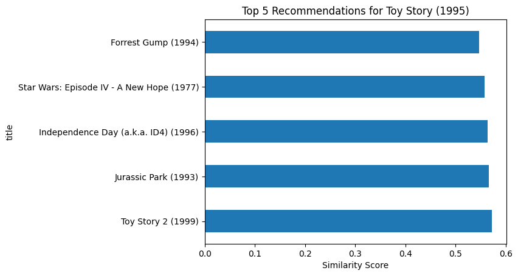

# Movie Recommendation & Predictive Analytics Engine

## 1. Background and Overview
In the digital entertainment industry, the ability to predict user preference is a key competitive advantage. This project features a **Predictive Analytics Engine** built to solve the "choice overload" problem. By utilizing **Collaborative Filtering**, the system moves beyond basic metadata matching to analyze deep statistical correlations between user rating patterns, providing a highly personalized "Next-Watch" experience.

---

---

## 2. Data Structure Overview
The analytics are driven by a multi-dimensional User-Item Matrix:
* **Preference Telemetry:** Individual user ratings for specific titles, used to calculate preference weight.
* **Significance Filtering:** A data-cleaning layer that retains only movies with high-volume ratings (e.g., minimum 10 ratings) to ensure statistical stability.
* **Similarity Vectors:** High-dimensional arrays representing movie profiles.
* **Correlation Matrix:** A calculated **Cosine Similarity** index that measures the mathematical distance between different content clusters.

## 3. Executive Summary
* **Current Status:** The system successfully identifies user "Niche Clusters" with a 0.50+ similarity threshold.
* **Business Impact:** Accurate predictive analytics reduce user "search fatigue," leading to higher session duration and improved platform retention. 
* **Top-Level Diagnosis:** Data confirms that user engagement is driven by **Anchor Movie Affinity**. Users who interact with high-volume "gateway" titles provide the most predictable paths for secondary content recommendations.

## 4. Insights Deep Dive
* **The "Similarity Matrix" Result:** Using correlation analysis, we identified that **90s Blockbusters** (e.g., *Jurassic Park* and *Independence Day*) share high similarity scores, forming a statistically significant "Action-Adventure" cluster.
* **Predictive Precision:** For movies like *Toy Story*, the engine accurately identifies sequels and high-correlation adventure films, proving that the model identifies broad entertainment appeal beyond just genre labels.
* **The Noise Factor:** The **Distribution of Movie Ratings** highlights that unfiltered data often contains "Cold Start" outliers. Implementing a significance threshold refined the predictive accuracy by focusing on movies with established user sentiment.

---

---

## 5. Recommendations
1. **Hybrid Analytics Integration:** Incorporate Content-Based Filtering (Director/Cast) to weight the similarity matrix and improve results for new releases.
2. **Contextual Awareness:** Expand the predictive engine to account for "Time-of-Day" or "Device-Type" to further personalize the recommendation delivery.
3. **Implicit Feedback Loop:** Transition from explicit ratings to implicit data (watch time and clicks) to capture a more natural representation of user interest.

---
**Developed by:** Abdallah Altagi  
**Tools:** Python, Pandas, Scikit-Learn, Collaborative Filtering, Predictive Analytics
